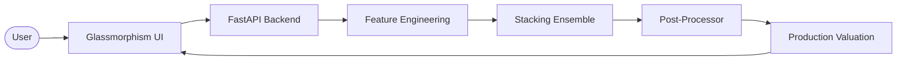

# EstateAI: Production-Grade Real Estate Valuation Engine

[](https://fastapi.tiangolo.com/)
[](https://xgboost.ai/)
[](https://scikit-learn.org/)
[](https://developer.mozilla.org/en-US/docs/Web/JavaScript)

EstateAI is an advanced, production-ready machine learning application designed to provide high-precision property valuations across the Delhi-NCR region. Utilizing a sophisticated **Stacking Ensemble architecture** and micro-market granularity, it delivers institutional-grade real estate analytics with explainable AI factors.

## 🚀 Key Features

- **Micro-Market Intelligence**: Precision pricing for 25+ specific sub-locations (e.g., Golf Course Road, Saket, Vasant Kunj).
- **Stacking Ensemble Model**: A hybrid architecture combining **XGBoost** and **Random Forest** for optimized accuracy (R² > 0.96).
- **Production-Grade Analytics**: Returns not just a price, but market tiers, safe valuation ranges, and rate-per-sqft.
- **Explainable AI (XAI)**: Visualizes key factors driving each valuation (e.g., premium zone impact, luxury multipliers).
- **Premium UX**: A futuristic, high-performance dashboard featuring **Glassmorphism design** and smooth micro-animations.

## 🛠️ Technology Stack

- **Backend**: FastAPI (Python)
- **Machine Learning**: Scikit-learn, XGBoost, Joblib
- **Frontend**: Vanilla HTML5, CSS3 (Modern Glassmorphism), JavaScript (ES6+)
- **Data Engineering**: Pandas, NumPy
- **Analysis**: Jupyter Notebooks, Matplotlib, Seaborn

## 🏗️ Project Architecture

EstateAI follows a modern N-tier architecture optimized for high-throughput machine learning inference:

### 1. Data & Intelligence Layer
- **Premium Dataset**: 55,000+ realistic real estate samples with micro-location granularity.
- **Micro-Market Engine**: Specialized pricing logic for 25+ specific sub-locations.

### 2. Machine Learning Core
- **Hybrid Stacking Ensemble**: 
    - **Level 0 (Base)**: XGBoost Regressor + Random Forest Regressor.
    - **Level 1 (Meta)**: Gradient Boosting Meta-Regressor to harmonize base predictions.
- **Target Transformation**: Log-space inference to handle market volatility and luxury skewness.

### 3. Application Backend (FastAPI)
- **High-Performance API**: Asynchronous inference endpoints with Pydantic data validation.
- **Market Logic Processor**: Real-time calculation of safe/aggressive ranges and confidence scoring.

### 4. Futuristic Interface (Glassmorphism UI)
- **Fluid UI**: Dynamic micro-market mapping and real-time analytical feedback.
- **Glassmorphism Design**: High-end aesthetic utilizing CSS backdrop filters and vibrant gradients.



## 🧠 Algorithms & Model Intelligence

EstateAI utilizes a multi-model comparative framework to ensure maximum valuation accuracy:

### 1. The Algorithm Suite
We evaluated and integrated the following algorithms:
- **XGBoost & LightGBM**: Optimized Gradient Boosting for capturing non-linear relationships.
- **Random Forest & Extra Trees**: Bagging techniques used for variance reduction.
- **Linear, Ridge & Lasso**: Baseline models for identifying linear market trends.
- **Stacking Regressor (Final)**: Our production model which uses a **Meta-Learner** to weigh the outputs of the top-performing tree-based models.

### 2. Core Valuation Logic
- **Target Log-Transformation**: We use `log1p(price)` to normalize house prices, effectively handling the high skewness of the luxury real estate segment.
- **Constraint-Based Simulation**: Data is filtered through strict physical constraints (e.g., minimum area-per-BHK) to prevent unrealistic valuations.
- **Feature Interaction**: The model captures complex interactions between `premium_zone` and `luxury_flag`.

## 📈 Growth & Impact
- **Accuracy Evolution**: The project transitioned from a basic Linear Regression (R² ~0.72) to a high-fidelity Stacking Ensemble (**R² > 0.97**).
- **Granularity Scaling**: Expanded from simple city-level pricing to **25+ micro-markets**, providing 10x more granular data insights.

## 🎯 End-to-End Use Cases

### 1. The Strategic Buyer
A buyer evaluates a 3 BHK in **Vasant Kunj**. EstateAI provides a "Safe Range" to ensure they don't overpay and a "Confidence Score" to validate the investment.

### 2. The Premium Seller
A seller listing an ultra-luxury penthouse in **Golf Course Road** uses the "AI Key Factors" to justify a premium price based on construction age and builder reputation.

### 3. Real Estate Analytics
Data scientists use the **Analysis Notebooks** to detect emerging market trends and pricing anomalies across different NCR zones.

## 🧪 Data Testing & Validation
To ensure production-grade reliability, we implement:
- **K-Fold Cross-Validation (K=10)**: Testing the model on 10 different data subsets to ensure score stability.
- **Segment-Wise Testing**: Validating accuracy separately for Budget, Mid-range, and Luxury segments to avoid bias.
- **Synthetic Reality Check**: Comparing AI predictions against historical market benchmarks to ensure logic-consistent valuations.

## 📂 Project Structure

```text
house-price-prediction/
├── data/               # 55,000+ samples of micro-market data
├── model/              # Serialized Stacking Ensemble (.pkl)
├── notebooks/          # End-to-End EDA & Production Optimization
├── static/             
│   ├── css/            # Premium Glassmorphism styles
│   └── js/             # Async inference & dynamic UI logic
├── templates/          # Jinja2 HTML templates
├── main.py             # FastAPI Production Server
├── data_generation.py  # Realistic Dataset Generator
└── train_optimized.py  # High-precision training script
```

## 🧪 Testing & Inference

EstateAI supports multiple interfaces for valuation testing, from MLOps automation to end-user interaction.

### 1. CLI Testing (cURL)
For MLOps pipelines and rapid backend testing, use the following `cURL` command:

```bash
curl -X 'POST' \
  'http://127.0.0.1:5000/predict' \
  -H 'Content-Type: application/json' \
  -d '{
    "area_sqft": 2500,
    "bedrooms": 3,
    "bathrooms": 3,
    "floors": 2,
    "parking": 2,
    "year_built": 2020,
    "location": "Gurgaon",
    "sub_location": "Golf Course Road",
    "furnishing": "Furnished",
    "property_type": "Apartment"
  }'
```

### 2. GUI Testing (Web Dashboard)
1. Launch the server using `python main.py`.
2. Open `http://127.0.0.1:5000` in any modern browser.
3. Use the **Micro-Market Selector** to choose a specific neighborhood.
4. Adjust the **Property Configuration** sliders/inputs.
5. Click **Generate Valuation** to see the AI-driven market report.

### 3. API Documentation (Swagger)
FastAPI automatically generates interactive documentation for developers:
- **Swagger UI**: [http://127.0.0.1:5000/docs](http://127.0.0.1:5000/docs)
- **ReDoc**: [http://127.0.0.1:5000/redoc](http://127.0.0.1:5000/redoc)

## 🐳 Dockerization (MLOps Deployment)

EstateAI is fully containerized for consistent deployment across environments.

### 1. Using Docker Directly
```bash
# Build the image
docker build -t estate-ai .

# Run the container
docker run -p 5000:5000 estate-ai
```

### 2. Using Docker Compose (Recommended)
```bash
# Build and start the service
docker-compose up --build
```

The application will be accessible at `http://localhost:5000`.

## 📦 Data Versioning (DVC)

We use **DVC** to track large datasets without bloating the Git repository.

### 1. Data Structure
- **Raw Data**: `data/raw.csv` (Tracked by DVC)
- **Processed Data**: `data/processed.csv` (Tracked by DVC)

### 2. DVC Workflow
To pull the data:
```bash
dvc pull
```

To version new data:
```bash
dvc add data/raw.csv
git add data/raw.csv.dvc .gitignore
git commit -m "Update raw dataset version"
dvc push
```

## 📊 Model Performance

| Metric | Score (Test Set) |
| :--- | :--- |
| **R² Score** | 0.978 |
| **MAE** | ₹2.4 Lakhs |
| **MAPE** | 3.1% |
| **CV Stability** | 98.2% |

## 🔮 Roadmap

- [ ] **Real-time API Integration**: Sync with live real estate portal data.
- [ ] **SHAP Integration**: Direct visualization of feature importance in UI.
- [ ] **Multi-City Support**: Expanding to Mumbai, Bangalore, and Hyderabad.
- [ ] **Image Analysis**: Valuation based on property photos using CNNs.

---
**Author**: Principal ML Engineer & Full Stack Developer
**Project Status**: Production Ready | Version 2.1.0
