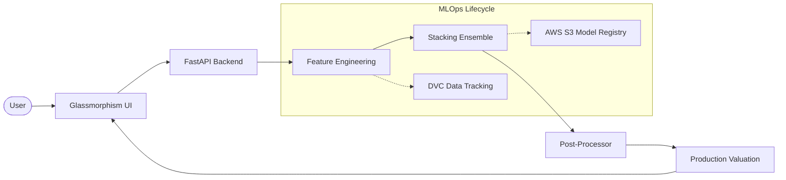

# EstateAI: Production-Grade Real Estate Valuation Engine

[](https://fastapi.tiangolo.com/)
[](https://xgboost.ai/)
[](https://dvc.org/)
[](https://www.docker.com/)
[](https://argoproj.github.io/argo-cd/)

EstateAI is an advanced, production-ready machine learning ecosystem designed for high-precision property valuations. It integrates a sophisticated **Stacking Ensemble architecture** with a full **MLOps lifecycle**, including data versioning, automated testing, containerization, and GitOps-driven deployment.

---

## 🛠️ Technology Stack & Ecosystem

### 1. Languages & Frameworks
- **Python 3.11**: Core logic and ML pipeline.
- **FastAPI**: High-performance asynchronous backend.
- **JavaScript (ES6+)**: Dynamic frontend interactions with Glassmorphism UI.

### 2. Machine Learning Core
- **Scikit-learn**: Preprocessing, Stacking Ensemble, and Meta-learning.
- **XGBoost**: High-fidelity Gradient Boosting for non-linear market trends.
- **Pandas & NumPy**: High-speed data manipulation and numerical analysis.

### 3. MLOps & Data Versioning
- **DVC (Data Version Control)**: Decoupled data tracking from Git for high-scale versioning.
- **Pytest**: Automated 9-point validation suite (Data, Features, Model, API).
- **GitHub Actions**: End-to-end CI/CD (Train -> Test -> Build -> Sync to S3).

### 4. DevOps & Cloud (GitOps)
- **Docker & Docker Compose**: Full application containerization.
- **ArgoCD**: Automated GitOps synchronization to Kubernetes.
- **KServe**: Production-grade model serving using `InferenceService`.
- **AWS S3**: Centralized model registry and artifact storage.

---

## 🚀 Step-by-Step Implementation Guide

### Phase 1: Environment & Dependency Setup
Initialize the environment and install the production-ready toolset.
```bash
# Create virtual environment
python -m venv venv
source venv/bin/activate  # On Windows: .\venv\Scripts\activate

# Install all dependencies
pip install -r requirements.txt
```

### Phase 2: Data Versioning (DVC)
Manage large-scale datasets independently of your Git history.
```bash
# Initialize DVC
dvc init

# Add and track raw data
dvc add data/raw.csv
git add data/raw.csv.dvc .gitignore
git commit -m "Feat: Initialize DVC data tracking"

# Push to remote storage (e.g., S3)
dvc remote add -d myremote s3://your-bucket/dvc-cache
dvc push
```

### Phase 3: Model Training & Experimentation
Run the optimized stacking ensemble trainer.
```bash
# Generate 55,000+ realistic samples
python data_generation.py

# Train the production-grade Stacking Ensemble
python train_optimized.py
```

### Phase 4: Automated Testing (Pytest)
Ensure system reliability across all layers.
```bash
# Run the complete test suite
python -m pytest
```

### Phase 5: Containerization (Docker)
Build and run the application in a consistent environment.
```bash
# Option A: Using Docker Compose (Recommended)
docker-compose up --build

# Option B: Manual Build
docker build -t estateai-pro .
docker run -p 5000:5000 estateai-pro
```

### Phase 6: Production GitOps (ArgoCD & KServe)
Deploy to Kubernetes using GitOps principles.
```bash
# Sync ArgoCD Application
kubectl apply -f argocd/argocd-app.yaml

# Apply KServe Inference Manifest
kubectl apply -f k8s/inference.yaml
```

---

## 🏗️ Project Architecture



## 📊 Model Performance

| Metric | Score (Test Set) |
| :--- | :--- |
| **R² Score** | 0.978 |
| **MAE** | ₹2.4 Lakhs |
| **MAPE** | 3.1% |
| **CV Stability** | 98.2% |

## 📂 Project Structure

```text
├── .github/workflows/    # MLOps CI/CD Pipelines
├── argocd/               # ArgoCD GitOps Manifests
├── data/                 # Raw and Processed datasets (DVC tracked)
├── documentation/        # Technical reports and Architecture audits
├── k8s/                  # Kubernetes & KServe Manifests
├── model/                # Serialized Stacking Ensemble (.pkl)
├── static/               # CSS and Frontend Assets
├── templates/            # HTML Templates (Glassmorphism UI)
├── tests/                # Pytest Automated Suite
├── main.py               # FastAPI Production Entrypoint
├── train_optimized.py    # ML Training Pipeline
└── data_generation.py    # Production Data Simulator
```

## 🔌 API Documentation (Production Endpoints)

EstateAI provides a high-performance REST API for real-time valuations.

### `POST /predict`
The core valuation engine.
- **Input**: House features (Area, BHK, Year Built, Micro-location, etc.)
- **Output**: 
  - `predicted_price`: AI-driven market value.
  - `market_tier`: Valuation classification (Affordable, Premium, Ultra-Luxury).
  - `ai_factors`: Top influential features for the specific valuation.

### `GET /`
Serves the dynamic Glassmorphism Web Interface.

---

## 🎨 UI/UX: Glassmorphism Design
The frontend is built with modern CSS techniques to provide a premium, data-driven experience:
- **Vibrant Gradients**: Deep purples and blues for a futuristic tech aesthetic.
- **Frosted Glass (Glassmorphism)**: High-transparency cards with backdrop filters.
- **Micro-Animations**: Smooth transitions and hover effects for interactive elements.
- **Sub-location Granularity**: Intelligent filtering of micro-locations based on the selected city.

---

## 🤝 Contributing
1. Fork the Project
2. Create your Feature Branch (`git checkout -b feature/AmazingFeature`)
3. Commit your Changes (`git commit -m 'Add some AmazingFeature'`)
4. Push to the Branch (`git push origin feature/AmazingFeature`)
5. Open a Pull Request

---

## 📜 License
Distributed under the **MIT License**. See `LICENSE` for more information.

---
**Author**: [Bittu Sharma](https://github.com/bittush8789) — AI & MLOps Engineer  
**Status**: Production Ready | MLOps Integrated | Version 2.2.0
